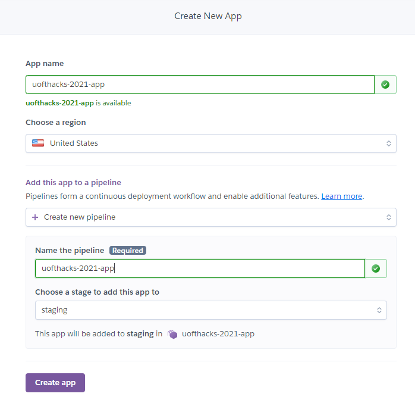
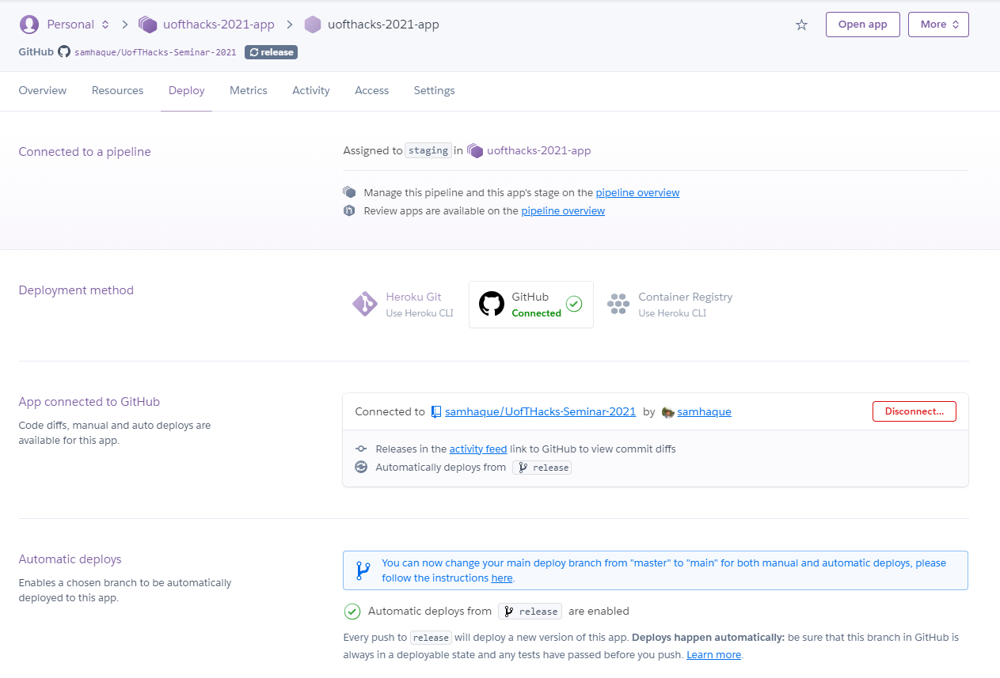
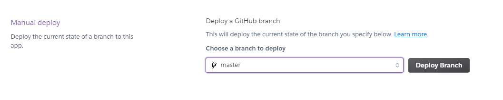

## Pre-Work
1. [Sign up for Heroku](https://www.heroku.com/home) (billing information NOT required for Free plan)
2. [Have a Github account](https://github.com/join)
3. [Git installed](https://git-scm.com/)
4. [SSH keys configured for your account](https://docs.github.com/en/github/authenticating-to-github/connecting-to-github-with-ssh)
5. [Docker installed](https://docs.docker.com/get-docker/)
6. [Install the heroku CLI](https://devcenter.heroku.com/articles/heroku-cli#download-and-install)

## Installation
1. Download and install latest version of Python for your operating system: [Here](https://www.python.org/downloads/)
2. Clone this project:
   ```
   git@github.com:samhaque/UofTHacks-Seminar-2021.git
   ```
3. Create a python virtual environment and install all the dependencies
   
   ### Windows
   ```
   python -m venv venv
   .\venv\Scripts\activate
   pip install -r requirements.txt
   ```
   ### Mac/Linux
   ```
   python3 -m venv venv
   source ./venv/bin/activate
   pip install -r requirements.txt
   ```
4. Run the app:
   ```
   uvicorn app.main:app --reload
   ```
5. Test the app:
   ```
   pytest test/test.py
   ```
   
## Build
1. Build the docker image:
   ```
   $ docker build -t uofthacks-2021-api .
   ```
2. Run and test the docker image:
   ```
   docker run --rm -it -p 8000:8000 uofthacks-2021-api
   ```

## Deploy to Heroku
[Docs](https://devcenter.heroku.com/articles/container-registry-and-runtime)

1. Go to the [Heroku Dashboard](https://dashboard.heroku.com/apps/)
2. [Onboard your new app](https://dashboard.heroku.com/new-app) by giving it a name and assign it
the region closest to you, and declaring a staging pipeline.
3. Run the following command on your terminal where the [Heroku CLI](https://devcenter.heroku.com/articles/heroku-cli#download-and-install) is installed.
   ``` 
   heroku stack:set container -a uofthacks-2021-app
   ```
   which will ask you to sign in and output the following message once completed:
   
   
4. Go to the [Heroku deployment pipeline dashboard](https://dashboard.heroku.com/apps/uofthacks-2021-app/deploy/github):
   
   Connect your Github account by clicking on the Github button beside `Deployment method`
   
   
   
5. `[OPTIONAL]` Create a `release` branch in your repository, and it will show up under the dropdown
beside `Automatic deploys`:
   ``` 
   git branch release
   git push --set-upstream origin release
   ```
6. If you did the optional step, all you have to do is make a [pull request](https://docs.github.com/en/github/collaborating-with-issues-and-pull-requests/about-pull-requests)
to the `release` branch, and once approved and merged, the build will take place. Very much like what happens on the day to day as a developer.
   
7. If you didn't do the `[OPTIONAL]` step then you can manually push it to Heroku either using the UI or using the [Heroku CLI](https://devcenter.heroku.com/articles/heroku-cli#download-and-install)
   